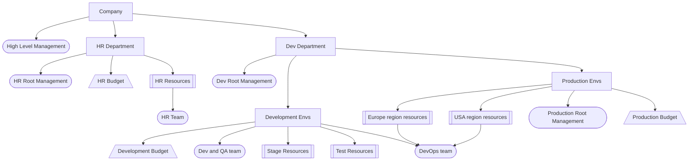

# Management and resource groups

## Goal (IT company example)

```mermaid
flowchart TB
    c[Company] --> hlm([High Level Management])
    c --> hrd[HR Department]
    c --> dvd[Dev Department]

    hrd --> hrrm([HR Root Management])
    hrd --> hrb[/HR Budget\]
    hrd --> hrr[[HR Resources]]
    hrr --> hrt([HR Team])

    dvd --> drm([Dev Root Management])
    dvd --> des[Development Envs]
    dvd --> pes[Production Envs]
    des --> db[/Development Budget\]
    des --> dqat([Dev and QA team])
    des --> sr[[Stage Resources]]
    des --> tr[[Test Resources]]
    des --> dot([DevOps team])

    pes --> err[[Europe region resources]]
    pes --> urr[[USA region resources]]
    pes --> prm([Production Root Management])
    pes --> pb[/Production Budget\]
    err --> dot
    urr --> dot
```
